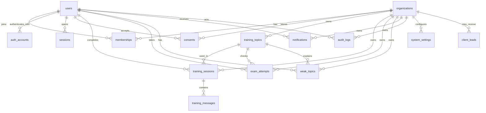

# HUNTERLITE: модель данных первой версии

Этот документ фиксирует Блок 2 модульного монолита: какую базу используем, какие таблицы нужны в первой версии, где хранится `organization_id`, какие данные считаются персональными и что можно использовать как demo seed.

## Выбор базы данных

Основная база данных: **PostgreSQL**.

Причины:

- платформа строится вокруг пользователей, организаций, ролей, тренировок, экзаменов и отчетов;
- нужны строгие связи между сущностями;
- нужна изоляция организаций через `organization_id`;
- нужны транзакции, миграции, индексы и аудит;
- позже можно добавить `pgvector` для AI/RAG без отдельной базы на старте.

Дополнительные хранилища позже:

- Redis — rate limit, кеш, очереди, временные состояния;
- S3-совместимое хранилище — файлы, если появятся документы или вложения;
- pgvector или Qdrant — только когда появится реальная задача векторного поиска.

## Главные правила модели

- `users` хранит человека, а не его роль.
- Роль пользователя внутри организации хранится в `memberships`.
- Все внутренние бизнес-таблицы должны иметь `organization_id`.
- Руководитель видит только данные своей организации.
- Сотрудник видит только свои тренировки, экзамены, слабые темы и уведомления.
- Внешний клиентский lead может быть без организации на первом шаге.
- Все опасные действия администратора пишутся в `audit_logs`.
- Пароли не хранятся в открытом виде, только `password_hash` в `auth_accounts`.

## Таблицы первой версии

| Таблица | Назначение | `organization_id` | Персональные данные | Demo seed |
| --- | --- | --- | --- | --- |
| `organizations` | Компании/тенанты платформы | Нет | Нет | Да |
| `users` | Пользователи платформы | Нет | Да | Да |
| `memberships` | Связь пользователя с организацией и ролью | Да | Да | Да |
| `auth_accounts` | Email/password, Google, Яндекс аккаунты | Нет | Да | Нет |
| `password_reset_tokens` | Одноразовые токены восстановления пароля | Нет | Да | Нет |
| `sessions` | Backend-сессии пользователя | Нет | Да | Нет |
| `consents` | Согласия на обработку данных | Да | Да | Да |
| `training_topics` | Темы тренировок и экзаменов | Да | Нет | Да |
| `training_sessions` | Тренировки, чат-тесты, результаты | Да | Да | Да |
| `training_messages` | Сообщения внутри тренировочной сессии | Да | Да | Да |
| `exam_attempts` | Попытки экзаменов и статус допуска | Да | Да | Да |
| `weak_topics` | Слабые темы пользователя | Да | Да | Да |
| `notifications` | Уведомления пользователя | Да | Да | Да |
| `client_leads` | Заявки внешних клиентов | Опционально | Да | Нет |
| `audit_logs` | Журнал действий и безопасности | Да | Да | Нет |
| `system_settings` | Настройки организации/платформы | Да | Нет | Да |

## ER-диаграмма

## Ключевые поля

### `organizations`

- `id` — UUID.
- `name` — название компании.
- `slug` — уникальный короткий идентификатор.
- `status` — active, suspended, archived.
- `created_at`, `updated_at`.

### `users`

- `id` — UUID.
- `email` — уникальный email.
- `full_name` — имя пользователя.
- `avatar_url` — опционально.
- `status` — active, blocked, invited.
- `last_login_at`.
- `created_at`, `updated_at`.

### `memberships`

- `id` — UUID.
- `organization_id` — ссылка на `organizations`.
- `user_id` — ссылка на `users`.
- `role` — employee, manager, admin.
- `status` — active, blocked, invited.
- `created_at`, `updated_at`.

### `auth_accounts`

- `id` — UUID.
- `user_id` — ссылка на `users`.
- `provider` — password, google, yandex.
- `provider_user_id` — ID пользователя у провайдера.
- `password_hash` — только для password provider.
- `failed_login_attempts` — счетчик неверных попыток входа.
- `locked_until` — время временной блокировки аккаунта после серии ошибок.
- `created_at`, `updated_at`.

### `password_reset_tokens`

- `id` — UUID.
- `user_id` — ссылка на `users`.
- `token_hash` — hash одноразового reset-токена, сам токен в базе не хранится.
- `expires_at` — срок действия токена.
- `used_at` — когда токен был использован.
- `created_at`.

### `sessions`

- `id` — UUID.
- `user_id` — ссылка на `users`.
- `expires_at` — срок действия.
- `revoked_at` — дата отзыва сессии.
- `created_at`.

### `training_sessions`

- `id` — UUID.
- `organization_id` — ссылка на `organizations`.
- `user_id` — ссылка на `users`.
- `topic_id` — ссылка на `training_topics`.
- `mode` — talk, exam_prep, chat_test.
- `difficulty` — basic, medium, hard.
- `format` — text, voice, sequence.
- `character` — тип AI-клиента.
- `question_count` — количество вопросов/шагов в сессии.
- `score` — итоговый балл.
- `evaluation_criteria` — JSONB с оценкой по критериям.
- `mistakes` — JSONB со списком ошибок.
- `recommendations` — JSONB с рекомендациями.
- `status` — draft, active, completed, failed.
- `started_at`, `completed_at`.

### `exam_attempts`

- `id` — UUID.
- `organization_id` — ссылка на `organizations`.
- `user_id` — ссылка на `users`.
- `topic_id` — ссылка на `training_topics`.
- `score` — итоговый балл.
- `passing_score` — проходной балл.
- `status` — active, passed, failed, review.
- `started_at`, `completed_at`.

### `notifications`

- `id` — UUID.
- `organization_id` — ссылка на `organizations`.
- `user_id` — ссылка на `users`.
- `type` — training, exam, recommendation, system.
- `title`, `body`.
- `read_at`.
- `created_at`.

### `audit_logs`

- `id` — UUID.
- `organization_id` — ссылка на `organizations`.
- `actor_user_id` — пользователь, совершивший действие.
- `action` — название действия.
- `target_type`, `target_id` — объект действия.
- `metadata` — JSONB с безопасными деталями.
- `created_at`.

## Индексы первой версии

- Уникальные: `users.email`, `organizations.slug`.
- Для tenant-фильтрации: `organization_id` во всех tenant-scoped таблицах.
- Для пользовательских экранов: `user_id` в тренировках, экзаменах, уведомлениях, слабых темах.
- Для отчетов: `topic_id`, `status`, `created_at`/`completed_at`.
- Для аудита: `organization_id`, `actor_user_id`, `action`, `created_at`.

## Что остается моковым в demo-mode

Можно seed-ить:

- demo organization;
- demo users и memberships;
- topics;
- sample training sessions;
- sample exam attempts;
- weak topics;
- notifications;
- system settings.

Нельзя seed-ить как реальные production-данные:

- auth session secrets;
- реальные OAuth accounts;
- реальные клиентские заявки;
- реальные audit events с персональными деталями.

## Приватность

Персональные данные есть в:

- `users`;
- `memberships`;
- `auth_accounts`;
- `sessions`;
- `consents`;
- `training_sessions`;
- `training_messages`;
- `exam_attempts`;
- `weak_topics`;
- `notifications`;
- `client_leads`;
- `audit_logs`.

Правила:

- не писать пароли, токены и полные персональные данные в логи;
- удаление пользователя делать через деактивацию и регламент удаления данных;
- доступ к данным всегда проверять через роль и `organization_id`;
- клиентский чат не должен раскрывать внутренние данные сотрудников.

## Кодовый контракт

Кодовая версия этой модели лежит в `src/lib/data-model.ts`.

Unit-тесты модели лежат в `src/test/data-model.test.ts`.
